<!-- ━━━━━━━━━━━━━━━━━━━━━━━━━━━━━━━━━━━━━━━━━━━━━━━━━━━━━━━━━━━━ -->
<!--                    🔥 KMM HANAN — GitHub Profile                -->
<!-- ━━━━━━━━━━━━━━━━━━━━━━━━━━━━━━━━━━━━━━━━━━━━━━━━━━━━━━━━━━━━ -->

<!-- ━━━━━━━━━━━━━ MAIN CONTENT TABLE ━━━━━━━━━━━━━ -->

<div align="center">

<table align="center" cellpadding="15" cellspacing="0">

<!-- ═══════════════ TYPING SVG ═══════════════ -->
<tr><td colspan="3" align="center"><br/><a href="https://git.io/typing-svg"></a><br/><br/></td></tr>

<!-- ═══════════════ ABOUT ME ═══════════════ -->


```yaml
name: Kmm Hanan
role: Flutter & Node.js Developer | UI/UX Designer
motto: "No satisfaction, no work."
```

🏦 &nbsp;Working as a Senior Software Engineer <a href="https://tech.kmm.zone" target="_blank">**@Tech Zone**</a><br/>
🌱 &nbsp;Exploring **Flutter · Node.js · Python**<br/>
💬 &nbsp;Ask me about **Flutter · React · Node.js · Python**<br/>
🤝 &nbsp;Open to discuss about **AI · LLMs**<br/>
🕸️ &nbsp;Portfolio → <a href="https://www.kmmhanan.com/" target="_blank">**kmmhanan.com**</a><br/>
📧 &nbsp;Reach me → **hanan@kmmhanan.com**

</td>
<td colspan="1" align="center" valign="center">

</td>
</tr>

<!-- ═══════════════ CONNECT WITH ME ═══════════════ -->
<tr><td colspan="3" align="center"><div style="font-size: 1.5em; font-weight: bold; margin: 0;"><br/><b>🔗 CONNECT WITH ME 🔗</b><br/><br/></div></td></tr>
<tr>
<td colspan="3" align="center">
<br/>
<a href="https://www.linkedin.com/in/kmmhanan" target="_blank"></a>&nbsp;
<a href="https://x.com/kmmhanan" target="_blank"></a>&nbsp;
<a href="https://t.me/kmmhanan" target="_blank"></a>&nbsp;
<a href="https://www.instagram.com/kmmhanan/" target="_blank"></a>&nbsp;
<a href="https://www.facebook.com/kmmhanan" target="_blank"></a>&nbsp;
<a href="https://discordapp.com/users/kmmhanan" target="_blank"></a>
<br/><br/>
<a href="https://dribbble.com/kmmhanan" target="_blank"></a>&nbsp;
<a href="https://stackoverflow.com/users/19575911" target="_blank"></a>&nbsp;
<a href="https://gitlab.com/kmmhanan" target="_blank"></a>&nbsp;
<a href="https://www.leetcode.com/kmmhanan" target="_blank"></a>&nbsp;
<a href="https://tryhackme.com/p/kmmhanan" target="_blank"></a>
<br/><br/>
</td>
</tr>

<!-- ═══════════════ TECH STACK ═══════════════ -->

<tr><td colspan="3" align="center"><div style="font-size: 1.5em; font-weight: bold; margin: 0;"><br/><b>⚙️ TECH STACK ⚙️</b><br/><br/></div></td></tr>
<tr>
<td colspan="3" align="center">
<br/>
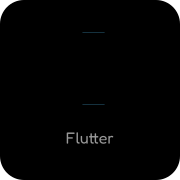&nbsp;&nbsp;
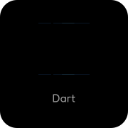&nbsp;&nbsp;
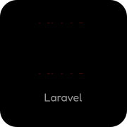&nbsp;&nbsp;
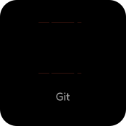&nbsp;&nbsp;
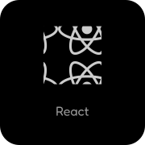&nbsp;&nbsp;
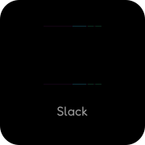&nbsp;&nbsp;
&nbsp;&nbsp;
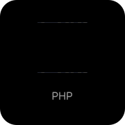
<br/><br/>
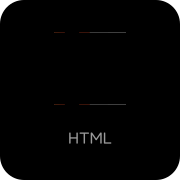&nbsp;&nbsp;
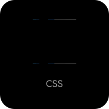&nbsp;&nbsp;
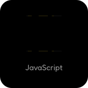&nbsp;&nbsp;
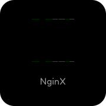&nbsp;&nbsp;
&nbsp;&nbsp;
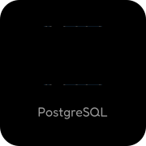&nbsp;&nbsp;
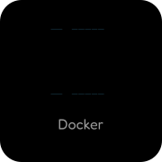&nbsp;&nbsp;
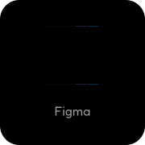
<br/>
<br/>
</td>
</tr>

<!-- ═══════════════ GITHUB ANALYTICS ═══════════════ -->
<tr><td colspan="3" align="center"><div style="font-size: 1.5em; font-weight: bold; margin: 0;"><br/><b>📈 GITHUB ANALYTICS 📈</b><br/><br/></div></td></tr>
<tr>
<td colspan="3" align="center">

<a href="https://github.com/kmmhanan"></a>
<br/><br/>
<a href="https://github.com/kmmhanan"></a>

</td>
</tr>

<!-- ═══════════════ CONTRIBUTION SNAKE ═══════════════ -->
<tr><td colspan="3" align="center"><div style="font-size: 1.5em; font-weight: bold; margin: 0;"><br/><b>🐍 CONTRIBUTION SNAKE 🐍</b><br/><br/></div></td></tr>
<tr>
<td colspan="3" align="center">

<picture>
  <source media="(prefers-color-scheme: dark)" srcset="https://raw.githubusercontent.com/kmmhanan/kmmhanan/output/github-snake-dark.svg" />
  <source media="(prefers-color-scheme: light)" srcset="https://raw.githubusercontent.com/kmmhanan/kmmhanan/output/github-snake.svg" />
  
</picture>

</td>
</tr>

<!-- ═══════════════ RANDOM DEV QUOTE ═══════════════ -->
<tr><td colspan="3" align="center"><div style="font-size: 1.5em; font-weight: bold; margin: 0;"><br/><b>💭 RANDOM DEV QUOTE 💭</b><br/><br/></div></td></tr>
<tr>
<td colspan="3" align="center" valign="center">


</td>
</tr>

<!-- ═══════════════ PROFILE BADGES ═══════════════ -->
<tr><td colspan="3" align="center">
  <div style="font-size: 1.5em; font-weight: bold; margin: 0;">
    <br/><b>👤 PROFILE BADGES 👤</b><br/><br/>
  </div>
</td></tr>

<tr>
  <td width="40%" align="center" valign="center">
    <br/>
    
    <br/><br/>
  </td>

  <td width="20%" align="center" valign="center">
    <br/>
    <a href="https://github.com/kmmhanan?tab=followers">
      
    </a>
    <br/><br/>
  </td>

  <td width="40%" align="center" valign="center">
    <br/>
    <a href="https://twitter.com/kmmhanan">
      
    </a>
    <br/><br/>
  </td>
</tr>

</table>

</div>

<!-- ━━━━━━━━━━━━━━━━━━━━━━━━━━━━━━━━━━━━━━━━━━━━━━━━━━━━━━━━━━━━ -->
<!--          Made with ❤️ by Kmm Hanan | kmmhanan.com               -->
<!-- ━━━━━━━━━━━━━━━━━━━━━━━━━━━━━━━━━━━━━━━━━━━━━━━━━━━━━━━━━━━━ -->
